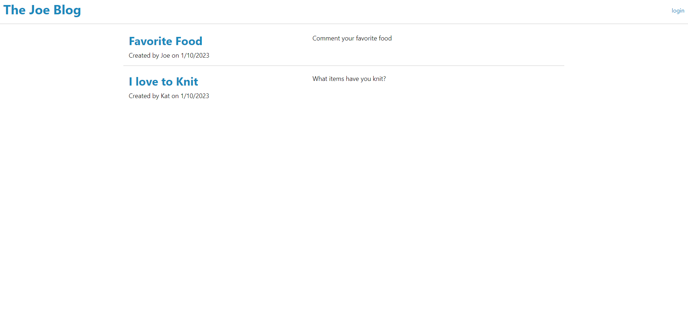
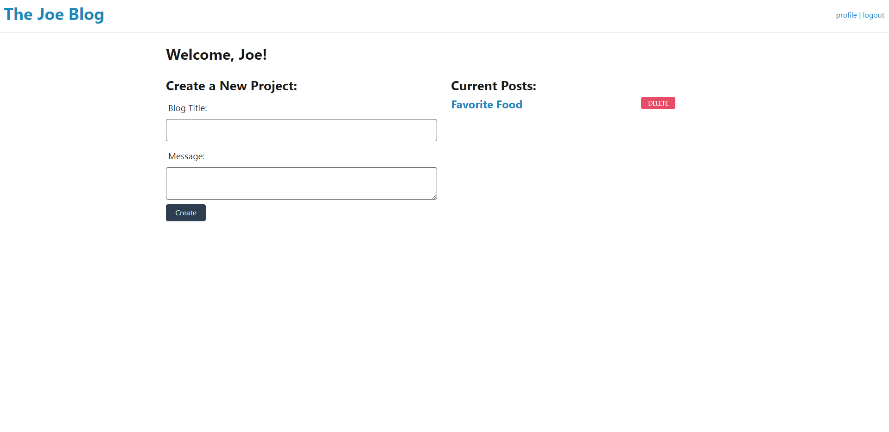
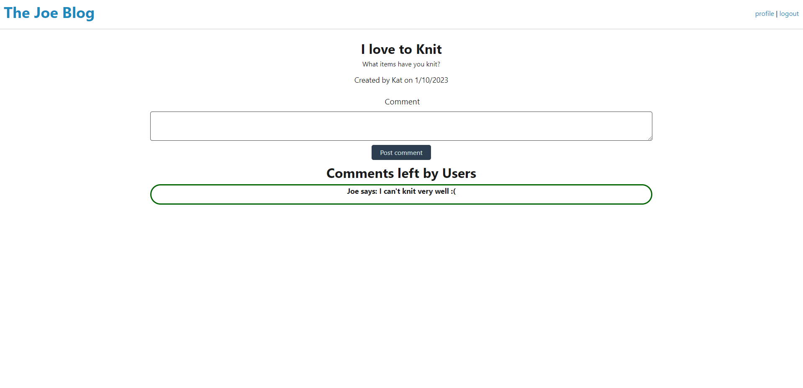

# MVC-challenge
MVC module challenge

## Description
* Users can create profiles
* Users can make blog posts
* Users can delete their own blog posts
* Users can comment on other blog posts if they are logged in

## Links
* Github: https://github.com/IRiceKrispie/MVC-challenge
* Deployed app: https://peaceful-refuge-48711.herokuapp.com/

## Screenshots

